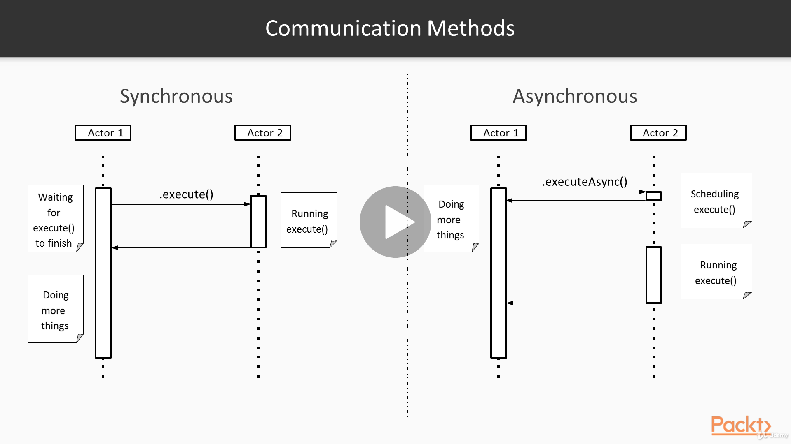

# Microservices Architecture

## Reference Documentation

This review of concepts is a summary for the section dealing with Integration of Multiple Microservices of Dimos Raptis's course on Udemy.

This is based primarily on the reference below:

* [Microservices Architecture](https://www.udemy.com/course/microservices-architecture/)

## Features

These are the key features that we'll cover in this review:

- Integration Methods

- Best Practices for Monitoring and Logging

## Integration of Multiple Microservices

In this section, we will see what are the alternative ways to integrate multiple microservices and the pros and cons of each one.

We'll start by discussing what are the available methods to integrate our microservices from high level concepts such as communication modes to lower level things, such as libraries and frameworks.

The next topic we'll cover monitoring and logging. We'll explain why these practices are very useful for microservices architecture and give some best practices.

## Integration Methods

In this first part, we will talk about the various methods that we can use in order to integrate multiple microservices, the trade-offs and some guidelines that kind of help us make the right choice.

### Communication methods

We'll start by examining the two main communication methods.

Two systems can communicate with each other either synchronously or asynchronously.

We'll use the generic term Actor here which can mean a thread, a process, or a server, but we can think of Actors as services deployed to different machines.

In a synchronous model, an Actor makes a request to another Actor and then has to wait for the response until it's able to execute something more.

On the other hand, in an asynchronous model, an Actor is capable of sending that request and as soon as the second Actor has acknowledged receiving the request, it is able to start doing other things. When the second Actor has completed processing the request, it will send a notification back. If the first Actor is interested in the result of the request, it will be able to process it at that point. 

There are multiple mechanisms for that such as callbacks, futures, etc., but we won't go into technical details here.

Communication Methods, by Dimos Raptis, [Udemy](https://www.udemy.com/course/microservices-architecture/).

Let's have a look at basic pros and cons of each approach.

- Synchronous

	- Easier to reason about

	- Simple to implement

	- Less space for concurrency

The synchronous model is much easier to reason about, since the execution is linear and easier to follow. It's also easier to implement, since most programming environments use a synchronous model for all the code by default.

However, this model usually leaves less space for concurrency, since we can always do one thing at a time.

- Asynchronous

	- More efficient

	- Suitable for long-running jobs

	- Increased complexity

	- Harder to test

On the other hand, the asynchronous model is much more efficient, since we are able to leverage parallelism and make a lot of things while waiting for responses from other systems.

It is also a very suitable model for long-running jobs, where we are not able to maintain a persistent connection for long periods.

However, this model introduces a lot of complexity, which can lead to anti-pattern, such as the callback hell.

However, there's been significant progress on that front, and there are a lot of libraries now that provide nice abstractions, such as the CompletableFuture API of Java.

We shold notice though that asynchronous APIs are almost always harder to troubleshoot and test when compared to synchronous ones.

## Communication Workflows

Going a step up, we will look now at a higher level concept: this of a communication workflow. This determines how more than two services can cooperate for a common goal.

As we can see, there are two main workflows.
a 
### Orchestration versus Choreography

The first one is called Orchestration is based on having a single service, which plays the role of an orchestrator, and combines a request from multiple sub-services to provide a final result, as we can see in the slide.

The second one is called Choreography. 

It's based on having multiple services, where each one plays its own role.

For instance, when there is an incoming request, Service A would receive it, perform some processing for its own purposes and then pass it on to Service B.

That Service performs its own processing as well and then passes the request on.

This goes on and on until all the processes have processed the request.

That transition of the request between the various services is usually done with the help of a messaging system, which can hold multiple events at the time and pass them on when the next service has capacity to process them.

It is important to note that these approaches can be combined with any of the communication modes we presented previously.

For example, the Orchestrator could use synchronous calls, but it could also make all the requests in parallel and combine them in the end using asynchronous communication.

Communication Workflows, by Dimos Raptis, [Udemy](https://www.udemy.com/course/microservices-architecture/).

### Orchestration versus Choreography: Pros and Cons

Here as some of the pros and cons of each approach.

- Orchestration

	- Simpler to understand

	- Business logic is testable very easily

	- Harder to evolve and extend

	- Risk of creating a service responsible for everything

	- More suitable for aggregation workflows

The Orchestration is simpler to understand and the business logic is testable very easily, since it is all encapsulated in a single service.

However, it can end up being harder to evolve and extend, since the orchestration service usually ends up having too much logic, making it difficult to add new responsibilities every time.

This approach can be a good fit for cases where we want to perform aggregations.

For instance, let's imagine an e-commerce web site, which contains a set of products along with recommendations for the customers and third party ads. That could be served by an orchestrator service which would be responsible for collecting all that data from multiple providers in an efficient way.

- Choreography

	- Loose Coupling

	- More resilient to failures

	- Harder to troubleshoot

	- Harder to test

	- Eventually consistent

The Choreography approach promotes loose coupling between services, when done properly.

This is because each service needs to only be aware of the message that's transferred and does not need to know what are the operations of downstream services.

It is also quite resilient to failures. A service can have an outage without causing failures to the whole system.

Messages will just get accumulated in a single place for that duration, and the service will catch up when it recovers.

However, as we can see, it is harder to troubleshoot and test, since an operation now is split between multiple services.

Another drawback is that it takes more time to see the results from the incoming request, which can be confusing sometimes.

This approach is very suitable for modeling business workflows that are by nature asynchronous. For example, an order of a physical product has to go through several states, such as Order Sent, Order Approved, Order Shipped, etc., and customers already expect for this whole process to take a while.

As a result, modeling each state as a separate service and connecting them via a messaging system seems a good approach.

### Integration Styles - REST versus RPC

Let's also have a look on the two main styles we can use to actually send data between two systems: REST and RPC.

#### REST

	- REST is not necessarily implemented on top of HTTP

	- HATEOAS principle

	- Media-type should be independent of the storage format

The first one stands for `Representational State Transfer`. The main idea behind it is to model our systems as Resources and actions on these Resources.

We should note that REST is technology agnostic, and can be implemented on top of any protocol. However, HTTP provides a lot of infrastructure, which can be used to implement REST easily, such as HTTP verbs and URLs for Resources.

One important principle of REST is `Hypermedia as the Engine of Application State`, abbreviated as HATEOAS.

What that practically means is that we can refer to a Resource from a different system in our response via a regular URL the way web pages can link to other web pages.

In our example here, we can see that the Song Resource refers to the author of a Song via a URL, which could be resolved by another service.

Last but not least, the Media Type that is used in the response should be independent of how data is stored physically to avoid coupling.

#### RPC

RPC, which stands for `Remote Procedure Call`, takes a different approach. In this time, we represent data transfer as actual method calls.

This allows us to design cleaner interfaces and help our clients understand better our service while also providing type-safety.

In order to avoid writing a lot of boilerplate code, RPC libraries usually come up with code generation tools. As a result, we only have to write a definition of our service interfaces and the models of our data.

From these, we can generate code that our clients can directly use to perform calls to our services.

One of these frameworks is called gRPC.

#### REST versus RPC

##### REST

		- HTTP provides already a lot of features

		- Promotes loose coupling via HATEOAS

		- Better toolset for development

		- Can be inefficient, due to chatty APIs

		- Some things cannot be modelled as Resources

		- Not suitable for implementation of transactional semantics

As we've mentioned previously, HTTP provides a nice foundation to implement REST quickly and easily.

When following the HATEOAS principle, we can decouple our systems, since services don't need to know about other services anymore and can only refer to URLs.

Because of HTTP, it results a better toolset for development and troubleshooting.

However, REST can be inefficient at times, because splitting our interfaces based on Resources can force us to make many more network calls.

Furthermore, some things cannot be modelled as Resources, such as the operation of printing a document.

Lastly, because of its distributed nature and fine-grained interfaces, it is not very suitable for implementing transactional semantics.

##### RPC

      - Promotes strong typing in interfaces

      - Makes the interface easier to understand

      - Reduces bugs

      - Saves development effort

      - Introduces more steps in our development process

      - Makes easier to forget about the implications of a remote call

For RPC, as we said previously, it encourages services to provide specific contracts and makes interfaces easier to understand.

It can also reduce defects not only because of strong typing, but also because RPC frameworks usually provide other common functionalities, which can be tricky to implement.

Because of that, and the fact that a lot of code is auto-generated, it can save significant development effort.

On the other hand, it introduces one more step in our development process, making it more complex and perhaps slower.

Another risk is that developers can get accustomed to the illusion of making local calls (instead of remote calls), ignoring factors such as network latency, failures, etc.

Also there are a few RPC frameworks, which are not interoperable with many languages. One classical example is the RMI framework, which is only available in Java.

Integration Styles - REST versus RPC, by Dimos Raptis, [Udemy](https://www.udemy.com/course/microservices-architecture/).

## Best Practices for Monitoring and Logging

In this section, we will introduce the concepts of Logging and Monitoring, explaining why they can be really valuable and go over some best practices.

### Why Logging?

But before anything else, the first question one could ask is: why do we need logging?

Logging allows us to understand what our software has done or is currently doing while executing. Logs from a system can be used to troubleshoot a specific problems by inspecting what the software did at various points in time.

We'll now go over some important best practices we should apply, starting from general principles and then discussing specifically for a microservices architecture. 

- In general:

	- Have different levels of logs (DEBUG/INFO/WARN/ERROR)

	- Include request ID

	- Use UTC timestamps

	- Use the appropriate amount of logging

A very useful practice is to have different levels of logging. In most cases, these four levels are sufficient. The debug level is information that would be useful only in case something is going wrong with a software and we want to find out what's happening in a great detail.

The info level is used for general information that could be useful for various cases.

The warn level can be used for cases when something unexpected is happening, which does not cause the system to fail, but should be further investigated.

Last and definitely not least, the error level is used in cases where something can make our system fail.

This leveling of logs can help us filter out unecessary information and inspect only what is needed.

When configured in a smart way, it also allows us to be performant and flexible at the same time.

For instance, we could set up our development environment to log at all levels but configure our Production systems to avoid logging a debug level to ensure there is no needless overhead.

Another basic principle is to include the `request ID` in our log format. In this way, when investigating a specific issue for a customer, we can find all information pertaining to the single request in a very fast way.

Of course when using timestamps, we should always use UTC timestamps, so that we can compare logs from different systems and locations in an easy way.

As we mentioned previously, we should take care to emit the right amount of logs from our systems, so that we don't affect their performance, but we still have the right amount of information available. There is no secret recipe to achieve that.

We should have that in mind when operating our service and take action when we think some logs are useless, or there could be some more logs that would help us, but they are missing.

Most of these principles hold in general, but in a microservices architecture, there are some more things we should take into account. First of all, we should have a centralized store for our logs.

- In a microservices architecture
	
	- Have a centralized logs store

	- Make logs searchable

	- Use correlation IDs

	- Log locally and transfer asynchronously

When operating a single server, it's practical to connect and see its logs directly, but as we scale our microservices architecture, and have more servers, we wont't be able to do that anymore.

On top of that, we won't be able to even know at which server a request arrives. So, we will have to search the logs of our whole fleet. As the number of servers increase, using common command line tools becomes slow and tedious.

Pushing our logs in a searchable store, such as an index, kind of enables us to search our logs for a word in a matter of milliseconds instead of minutes.

In a microservices architecture, a customer's request can span multiple services, so we will need to be able to track theses request accross services. To achieve that, we can use `correlation IDs`. This is a random identifier that's generated from the first service, is passed through all the services in our architecture and is included in their logs.

So when multiple teams are troubleshooting a specific issue, they can refer this correlation ID while looking at logs of different systems.

In order to store logs in a central place, we will have to transfer them via the network from our servers.

There are multiple techniques to do that, but we should avoid sending these data synchronously on each logging operation. Instead, we can store the logs locally in logs files and send them asynchronously in batches.

In this way, even if there is a network failure and the servers can't connect to the log store, they could still perform their core functionality.

### Why Monitoring?

As we explained previously, logging helps us understand what our systems are doing. However, sometimes we don't need the level of details the logs provide. What we need is a more high level picture of the health and state of our systems.

This can be achieved with the use of monitoring.

The main difference between logging and monitoring is their granularity and ease of consumption. Logs can provide information in greater detail, but requires more work from us to find what we're looking for.

On the other hand, with monitoring, we can get a picture of our system state quickly and easily, but if we want to look for something specific, we might need to look into the logs.

We'll now spend some time looking at some best practices following the same structure as before.

- Best practices for Monitoring

	- In general:

		- Understand the difference between system metrics and application metrics.

		- Combine monitoring with alarming

		- Prefer asynchronous over synchronous transport

		- Leveraging existing tools

First of all, we should make the distinction clear between system metrics and application metrics.

The former type includes metrics that indicate the performance of our systems, while the latter type includes metrics that see the business impact of our applications.

To give an example, the CPU utilization of our servers is a system metric, while the number of published songs is an application metrics.

These two types of metrics have different audiences, since system metrics are usually consumed by developers and operators, while application metrics can also be consumed by business people.

Making this distinction clean can guide us into what kind of metrics we capture in each category and how we visualize them.

That being said, however, capturing both categories using the same tools and infrastructure can help a lot.

Setting up alarms on our metrics can be really useful to identify anomalies, since otherwise, we're under risk of missinig important events or changes to our systems.

As with logs, the preferred approach is to store metrics locally and transmit them to the monitoring systems periodically in batches.

Of course there are a lot of tools in this space, so we should consider using one of those if it solves our problem, before building something from scratch.

More specifically, in a microservices architecture, it's really valuable to define and measure specific `Key Performance Indicators (KPIs)`, which will help us measure what impact our services have in business terms.

We should also define specific `Service Level Objectives (SLOs)`, which will determine the quality of service our systems should provide to their clients.

- In a microservices architecture:

	- Setup appropriate KPIs and SLOs

	- Measure performance metrics both at an overall level and per host

	- Focus on the edge of systems

	- Maintain historic data to identify trends

	- Use the appropriate statistics to get the right picture

Ideally, we should measure and alarm aggressively when our systems cross this	 treshold. For performance metrics, our monitoring system should provide access to the data both in a aggregated format and for each machine.

This is vital for troubleshooting problems where we might need to identify exactly which servers are having issues.

When thinking what kind of metrics we should capture, we should focus on the edge of our systems. This means that wherever a system communicates with another system, we should capture metrics around the throughput latency and errors of this communication.

This will make it easier to reason about our systems and be able to quickly identify which of them is misbehaving.

One thing that could also help on that is maintaining historic data so that we can compare with past data and identify when something is not normal.

Last but not least, we should make sure that we are using the appropriate statistics. For instance, when measuring the latency experienced by customers using percentage instead of average is generally a better option, because that way we will be able to understand what's the case for the worst cases, which will be the customers that are having the worst experience.

### Observability

`A measure of how well internal states of a system can be inferred from knowledge of its external ouput`.

Logging and Monitoring have a common underlying goal of making our systems more observable.

This means that based on the logs and the metrics available, we should be able to reconstruct a view of the state of our systems.

The bigger and more complex our microservices architecture becomes, the bigger the value of logging and monitoring becomes, as there are more moving parts and that makes the overall system harder to reason about.

